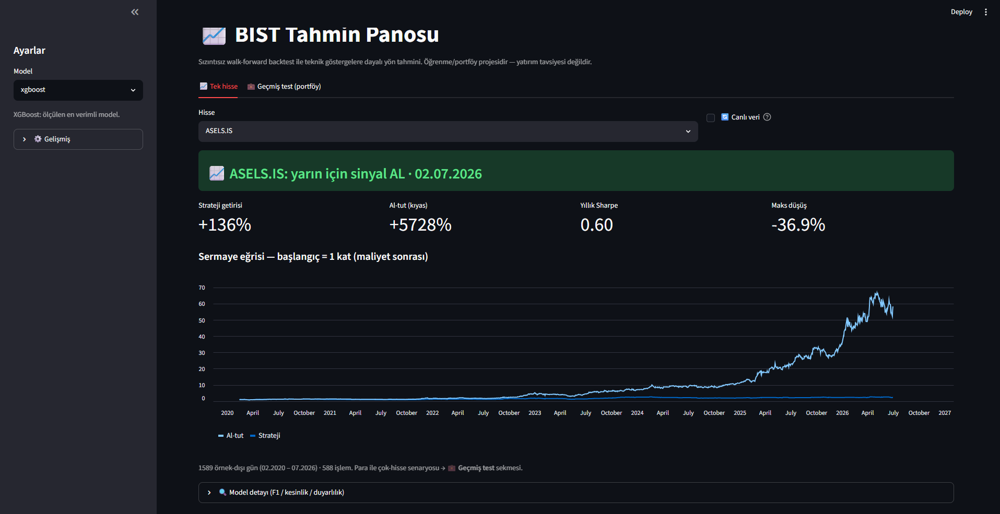
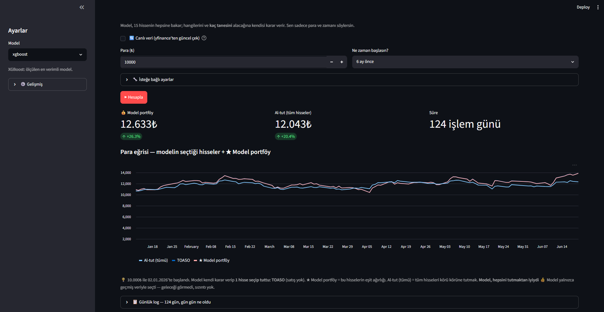

# BIST Yön Tahmini + Model Portföyü

> 🇬🇧 **English summary** — Next-day direction prediction for 15 Borsa Istanbul stocks from technical indicators, built around one idea: an **honest evaluation**. Walk-forward backtesting (no look-ahead leakage), transaction costs deducted, every result benchmarked against buy & hold, and directional accuracy always shown next to the majority base rate. On THYAO, out-of-sample XGBoost reaches **60.5% accuracy, Sharpe 1.25, +552%** (vs a naive RSI bot's +82% on the same honest terms). A Streamlit app adds a **model portfolio**: pick a past date and money, and the model decides *which* stocks and *how many* to buy-and-hold — beating "hold everything" in every period tested. Includes unit tests + CI. Educational project, not financial advice.

Borsa İstanbul hisseleri için teknik göstergelerle "yarın yükselir mi?" tahmini yapan bir proje. Derdim yüksek getiri değil, **dürüst bir değerlendirme** kurmaktı: çoğu borsa/ML projesi veri sızıntısı, atlanan işlem maliyeti ve eksik kıyaslar yüzünden gerçek olmayan sonuçlar gösteriyor — ben bunların hepsinden kaçınmaya çalıştım.

Öğrenme amaçlı bir portföy projesi — **yatırım tavsiyesi değildir.**





## Ne yapıyor

İki yetenek var:

1. **Tek hisse yön tahmini** — Bir hisse seç; model "yarın %1'den fazla yükselir mi?" sorusunu yanıtlar (sinyal) ve geçmiş başarısını sızıntısız backtest ile gösterir.
2. **Model portföyü (geçmiş test)** — Geçmişte bir tarih ve para seç; model **15 hisseye birden** bakıp *hangilerini* ve *kaç tanesini* alacağına **kendisi** karar verir, alıp tutar, sonucu "hepsini eşit tut" ile kıyaslar.

Girdi olarak fiyat, hacim, RSI, MACD, hareketli ortalama farkları, volatilite ve USD/TRY değişimi kullanılıyor. Hedef: ertesi gün getirisinin %1 eşiğini aşıp aşmayacağı (ikili sınıflandırma).

## Dürüst değerlendirme (projenin özü)

- **Sızıntısız walk-forward:** Yakın geçmişle eğit → hemen sonrasını test et → pencereyi kaydır. Test hep eğitimin *geleceğinde* kalır. Bilerek `train_test_split` kullanmadım — zaman serisinde gelecekten geçmişe bilgi sızdırır.
- **İşlem maliyeti:** Her pozisyon değişiminde binde ~1.5 düşülür.
- **Al-tut kıyası:** Hiçbir sonuç tek başına sunulmaz; hepsi al-tut (buy & hold) ile karşılaştırılır.
- **Taban oran farkındalığı:** Yön isabeti her zaman taban oranın (hep çoğunluk sınıfını söyleme doğruluğu) yanında gösterilir. Dengesiz veride "yüksek doğruluk" yanıltıcıdır.
- **Overfitting'e karşı:** Karar eşiğini düşürünce backtest getirisi artıyordu; yapmadım — sonucu görüp ayar çekmek test'e uydurmaktır. Eşik 0.5'te sabit.

## Sonuçlar

### Tek hisse — herkes aynı dürüst terazide (THYAO, örnek-dışı, maliyetli)

Rakip projelerin yaklaşımlarını (basit RSI kuralı, momentum) kendi sızıntısız motorumuzla, kendi 3 modelimizle yan yana koşturdum:

| Yöntem | Doğruluk | Getiri | Sharpe | Maks düşüş |
|---|---|---|---|---|
| RSI kuralı (RSI-bot tarzı) | 60.2% | +82% | 0.52 | −34.5% |
| Momentum kuralı | 50.5% | +441% | 1.09 | −31.4% |
| Lojistik regresyon | 52.2% | +296% | 0.85 | −34.8% |
| LightGBM | 56.9% | +281% | 0.90 | −36.9% |
| **XGBoost (ana model)** | **60.5%** | **+552%** | **1.25** | **−27.8%** |

*(Taban oran ~%68 · aynı dönemde al-tut +2941%)*

İki bulgu: (1) XGBoost her metrikte önde — bu yüzden panonun varsayılanı o. (2) RSI kuralıyla doğruluk neredeyse aynı (60.2 vs 60.5) ama getiri/Sharpe çok farklı → **doğru tahmin değil, doğru günlerde risk almak** kazandırıyor.

**Dürüst not:** Böyle güçlü bir boğa piyasasında teknik göstergeler tek başına al-tut'un ham getirisini (+2941%) yenmiyor. Modelin kattığı şey daha iyi Sharpe ve daha sınırlı düşüş — ve asıl değer, aşağıdaki portföyde ortaya çıkıyor.

### Model portföyü — model kendi seçince

"Geçmiş test"te model 15 hisseden hangilerini ve kaç tanesini alacağına kendisi karar verip tutuyor. Farklı dönemler, **hepsini eşit tutmaya karşı**:

| Başlangıç | Model kendi seçti | Model getirisi | Hepsini tut |
|---|---|---|---|
| 3 ay önce | 3 hisse | **+23.5%** | +7.5% |
| 6 ay önce | 1 hisse | **+26.5%** | +20.4% |
| 1 yıl önce | 6 hisse | **+34.0%** | +30.3% |
| 2 yıl önce | 6 hisse | **+62.0%** | +37.4% |

Test edilen **her dönemde** model, körü körüne "hepsini tut"maktan iyiydi — üstelik kaç hisse tutacağına da kendisi karar vererek. (Sızıntısız: model yalnızca kesim tarihine kadarki veriyle seçer.)

## Pano (Streamlit)

İki sekme:

- **📈 Tek hisse:** Hisse seç → yarınki sinyal (AL/BEKLE) + sızıntısız sermaye eğrisi + model detayı (F1/kesinlik/duyarlılık).
- **💼 Geçmiş test (portföy):** Para + zaman gir → model kendi hisselerini seçip tutar. Her hisse grafikte farklı renk, **★ Model portföy** kalın çizgi. Altında **gün gün log** (her günün getirisi, para, hisse hareketleri) + CSV indirme.

Ekstralar: 15 hissenin hepsi hazır; **🔄 Canlı veri** kutucuğuyla yfinance'ten güncel çekim; model kaç hisse tutacağına kendi karar verir (istenirse elle sabitlenebilir).

## Dosyalar

```
01_veri_ve_ozellikler.py   veri çekme + özellikler (yfinance; --usdtry, --endeks)
02_backtest.py             sızıntısız walk-forward backtest motoru
03_model.py                modeller + olasılıklar (lojistik, XGBoost, LightGBM)
04_dashboard.py            Streamlit panosu (tek hisse + portföy)
tests/                     birim testler (pytest)
borsa_veri.csv             15 BIST hissesi, işlenmiş örnek veri (2018–2026)
```

## Çalıştırma

```bash
pip install -r requirements.txt
streamlit run 04_dashboard.py        # panoyu açar (hazır veriyle)
```

Veriyi kendin üretmek (isteğe bağlı):

```bash
python 01_veri_ve_ozellikler.py --hisseler THYAO.IS GARAN.IS AKBNK.IS ... --usdtry
```

## Testler

Backtest motorunun kritik parçaları (Sharpe, maksimum düşüş, işlem maliyeti, sızıntısız pencere kaydırma + kuyruk, hedef etiketleme) birim testlidir; her push'ta GitHub Actions üzerinde otomatik koşar.

```bash
python -m pytest
```

## Notlar

- Geçmiş performans geleceği bağlamaz; bu bir öğrenme/portföy projesidir.
- Sayılar donmuş örnek veriye (2018–2026) aittir; canlı modda güncel veriyle değişir.
- Sıradaki fikir: Türkçe haber/yorum verisinden duygu skoru çıkarıp (BERTurk) teknik veriyle birleştirmek — teknik tarafın tek başına tavanı görüldü.
