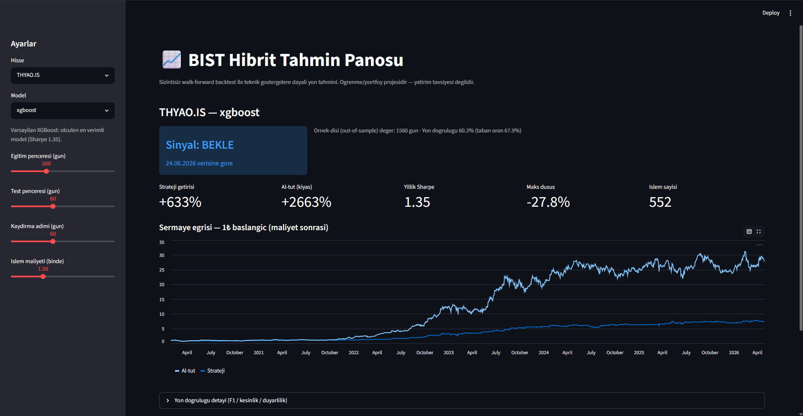

# BIST Hibrit Tahmin

> 🇬🇧 **English summary** — Next-day direction prediction for Borsa Istanbul stocks from technical indicators, with an honest evaluation setup: walk-forward backtesting (no look-ahead leakage), transaction costs included, and every result benchmarked against buy & hold. Out-of-sample, XGBoost reaches Sharpe 1.35 with 60.3% directional accuracy (below the 67.9% majority base rate — exactly why returns, not raw accuracy, are the yardstick here) — and still does not beat buy & hold in a strong bull market, which the project openly reports. Includes a Streamlit dashboard and unit tests. Educational project, not financial advice.

Borsa İstanbul hisseleri için teknik göstergelerle "yarın yükselir mi?" tahmini yapan bir proje. Derdim yüksek getiri değildi; **dürüst bir değerlendirme** kurmaktı. Çoğu borsa/ML projesi veri sızıntısı yüzünden gerçekçi olmayan sonuçlar gösteriyor, ben bundan kaçınmaya çalıştım.

Öğrenme amaçlı bir portföy projesi — yatırım tavsiyesi değil.



## Ne yapıyor

Fiyat, hacim, RSI, MACD, volatilite gibi göstergelerden özellik çıkarıp "ertesi gün getirisi %1'i geçecek mi?" sorusunu bir sınıflandırma problemi olarak çözüyor.

Değerlendirmeyi walk-forward ile yapıyorum: yakın geçmişle eğit, hemen sonrasını test et, pencereyi kaydır. Böylece test hep eğitimin geleceğinde kalıyor ve sızıntı olmuyor. Bilerek `train_test_split` kullanmadım — zaman serisinde gelecekten geçmişe bilgi sızdırır.

Sonuçlara accuracy ile değil; işlem maliyeti (binde ~1.5) düşülmüş getiri, Sharpe ve maksimum düşüş ile bakıyorum, hepsini de al-tut (buy & hold) ile karşılaştırıyorum.

## Sonuç (THYAO, 2020–2026, örnek-dışı)

| | Strateji | Al-tut |
|---|---|---|
| Getiri | +633% | +2663% |
| Sharpe | 1.35 | — |
| Maks düşüş | −27.8% | daha derin |
| Yön isabeti | %60.3 (taban oran %67.9) | — |

Dürüst olmak gerekirse: teknik göstergeler tek başına, böyle güçlü bir boğa piyasasında al-tut'un getirisini yenmiyor; kazandırdığı şey makul bir Sharpe ve daha sınırlı düşüş. Yön isabetine de dikkat: %60.3 iyi görünse de taban oran %67.9 — yani "hep düşecek" diyen bile isabette önde olurdu. İsabet oranının tek başına neden yanıltıcı olduğunun kanıtı bu; ölçütüm maliyet sonrası getiri.

Karar eşiğini düşürünce backtest getirisi artıyordu, ama bunu yapmadım: sonucu görüp ona göre ayar çekmek test'e uydurmak (overfitting) olurdu. Varsayılan eşiği 0.5'te bıraktım.

## Hangi model?

Üç modeli aynı koşulda denedim:

| Model | Doğruluk | Sharpe | Getiri |
|---|---|---|---|
| Lojistik | 0.519 | 0.81 | +256% |
| XGBoost | 0.603 | 1.35 | +633% |
| LightGBM | 0.567 | 0.98 | +316% |

XGBoost her metrikte önde, o yüzden panoda varsayılan o.

## Dosyalar

```
01_veri_ve_ozellikler.py   veri çekme + özellikler (yfinance)
02_backtest.py             walk-forward backtest motoru
03_model.py                modeller (lojistik, XGBoost, LightGBM)
04_dashboard.py            Streamlit arayüzü
tests/                     birim testler (pytest)
borsa_veri.csv             örnek işlenmiş veri
```

## Çalıştırma

```bash
pip install -r requirements.txt
python 01_veri_ve_ozellikler.py --usdtry   # borsa_veri.csv üretir (hazır olanı da kullanabilirsin)
streamlit run 04_dashboard.py     # panoyu açar
```

Panoda hisse, model ve eğitim/test penceresini seçip güncel sinyali, maliyet sonrası metrikleri ve sermaye eğrisini görebilirsin. Kenar çubuğundaki **🔄 Canlı veri** kutucuğu, seçili hisseyi yfinance'ten güncel veriyle çeker ve modeli o an yeniden eğitir; kapalıyken repodaki donmuş örnek veri kullanılır (README'deki sabit sayılar buna aittir). Yeni bir BIST kodu da girebilirsin.

## Testler

Backtest motorunun kritik parçaları (Sharpe, maksimum düşüş, işlem maliyeti, sızıntısız pencere kaydırma, hedef etiketleme) birim testlidir; her push'ta GitHub Actions üzerinde otomatik koşarlar.

```bash
python -m pytest
```

## Notlar

- Geçmiş performans geleceği bağlamaz; bu bir öğrenme projesi.
- Geliştirirken ayrıca eşik taraması, para simülasyonu gibi analiz scriptleri de yazdım; repoyu sade tutmak için onları eklemedim.
- Sıradaki fikir: Türkçe haber/yorum verisinden duygu skoru çıkarıp (BERTurk) teknik veriyle birleştirmek. Teknik tarafın tek başına tavanına geldim.
